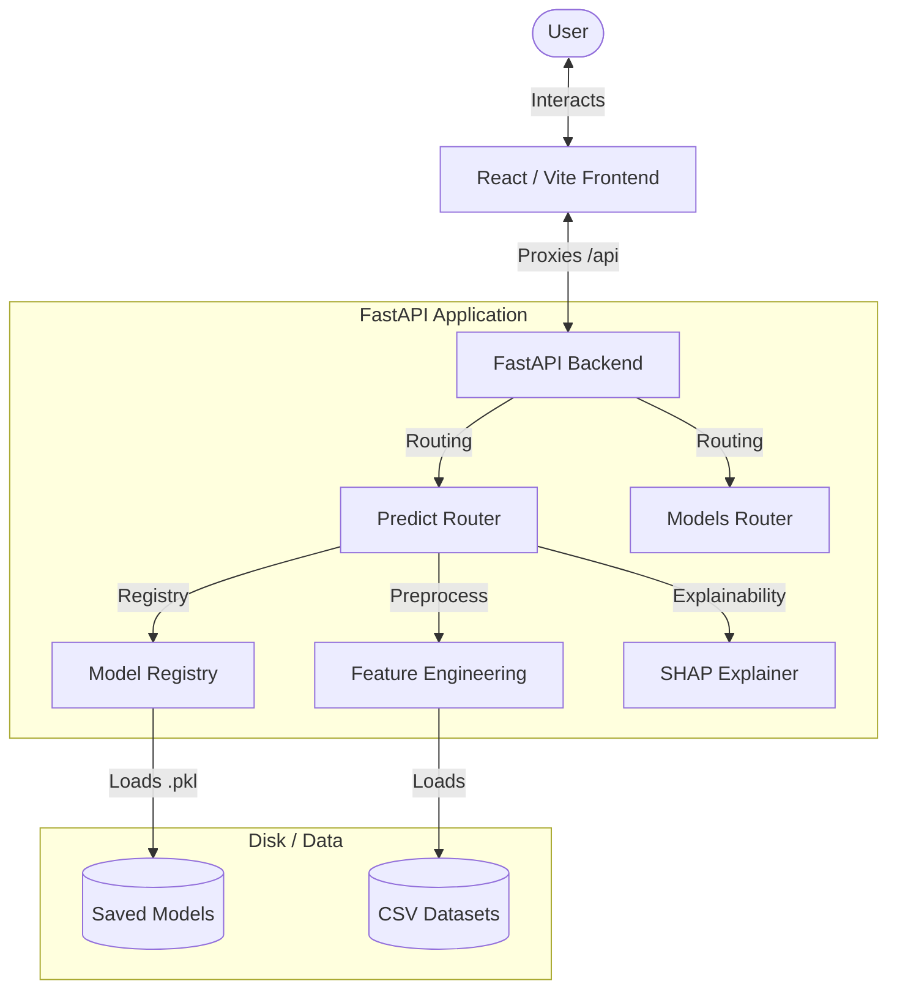

# 🎓 NaukriPredict (v3.0.0)

NaukriPredict is an advanced, multi-model student placement likelihood and salary estimation system. It features a modern **Neobrutalist React frontend** and a high-performance **FastAPI backend** running machine learning pipelines with local explainability powered by **SHAP**.

---

## 🏗️ Architecture Overview

The application utilizes a decoupled client-server architecture:
- **Frontend**: Built using React, Vite, and Tailwind CSS. It communicates with the backend via a reverse proxy configured in Vite.
- **Backend**: Built with FastAPI. It handles prediction requests, loads serialized ML pipelines, and computes SHAP feature importances on-the-fly.



---

## ✨ Key Features

- **Dual-Task Predictions**:
  - **Classification**: Predicts whether a student will be placed and the probability using one of four models (Random Forest, Gradient Boosting, Logistic Regression, or Support Vector Machine).
  - **Regression**: Estimates the annual salary package (in LPA) for students predicted to be placed.
- **Explainable AI (SHAP)**: Provides local explanation bars indicating which factors (e.g., CGPA, internships, skill rating) had a positive or negative impact on the placement likelihood.
- **Model Comparison Dashboard**: Compare accuracy, F1-scores, ROC-AUC, RMSE, and R² metrics dynamically across all trained algorithms.
- **Modern Neobrutalist UI**: Rich, high-contrast user interface built with smooth Framer Motion animations and interactive charts/meters.

---

## 🛠️ Technology Stack

### Frontend
- **Framework**: React 19 (via Vite)
- **Styling**: Tailwind CSS & Vanilla CSS (Neobrutalist styling tokens)
- **Charts**: Recharts
- **Animations**: Framer Motion
- **HTTP Client**: Native Fetch API (proxied via Vite server)

### Backend
- **Framework**: FastAPI (Python 3.13)
- **Web Server**: Uvicorn
- **ML Engine**: Scikit-Learn, Joblib, SHAP
- **Data Wrangling**: Pandas, NumPy, JSON-based Model Registry

---

## ⚙️ Project Structure

```
naurkiPredict/
├── backend/
│   ├── app/
│   │   ├── ml/
│   │   │   ├── preprocessing.py   # Feature engineering & data mapping
│   │   │   ├── registry.py        # Model loading & SHAP computation
│   │   │   ├── schemas.py         # Pydantic request/response validation
│   │   │   └── train.py           # Training script for ML models
│   │   ├── routers/
│   │   │   ├── models.py          # Metadata & model comparison endpoints
│   │   │   └── predict.py         # Prediction & explanation endpoint
│   │   └── main.py                # FastAPI app config and middleware
│   ├── data/                      # Dataset CSVs (students, placements)
│   ├── models/                    # Trained model binaries (.pkl) & registry.json
│   ├── requirements.txt           # Python backend dependencies
│   └── .env                       # Backend environment settings
├── frontend/
│   ├── src/
│   │   ├── components/            # UI components (PredictForm, ModelCompare, etc.)
│   │   ├── App.jsx                # Main layout canvas & state manager
│   │   ├── index.css              # Styling system & Neobrutalist tokens
│   │   └── main.jsx               # React DOM injection point
│   ├── package.json               # Node.js dependencies
│   └── vite.config.js             # Vite proxy & configuration
├── naukri/                        # Python virtual environment (ignored)
└── README.md                      # This documentation
```

---

## 🚀 Getting Started

### Prerequisites
- **Python**: `3.10` or higher (tested on `3.13`)
- **Node.js**: `18.0` or higher
- **PackageManager**: `npm`

---

### Step 1: Set Up & Run the Backend

1. Navigate to the backend directory:
   ```bash
   cd backend
   ```
2. Activate your virtual environment:
   * **Windows (PowerShell)**:
     ```powershell
     ..\naukri\Scripts\Activate.ps1
     ```
   * **macOS/Linux**:
     ```bash
     source ../naukri/bin/activate
     ```
3. Install Python dependencies:
   ```bash
   pip install -r requirements.txt
   ```
4. *(Optional)* Train the models (if model `.pkl` files are not generated):
   ```bash
   python -m app.ml.train
   ```
5. Run the FastAPI development server:
   ```bash
   python -m uvicorn app.main:app --host 127.0.0.1 --port 8000 --reload
   ```
   The backend will be available at `http://127.0.0.1:8000`. You can inspect the interactive OpenAPI documentation at `http://127.0.0.1:8000/docs`.

---

### Step 2: Set Up & Run the Frontend

1. Navigate to the frontend directory:
   ```bash
   cd ../frontend
   ```
2. Install frontend dependencies:
   ```bash
   npm install
   ```
3. Start the Vite React development server:
   ```bash
   npm run dev
   ```
   The frontend dev server will start at `http://localhost:5173/`. Vite will automatically proxy any `/api/*` endpoints to the local FastAPI backend.

---

## 📊 Preprocessing & Feature Engineering

The backend performs custom preprocessing on student profiles:
- **Categorical Mapping**: Ordinal variables like gender, family income, internet access, and city tier are mapped to numeric values.
- **Combined Indicators**:
  - `practical_experience` = `projects_completed` + `internships_completed` + `hackathons_participated`
  - `skill_rating` = `(0.5 * coding_skill) + (0.2 * communication_skill) + (0.3 * aptitude_skill)`
- **One-hot Encoding**: Categorical fields such as the engineering branch are one-hot encoded (`branch_CSE`, `branch_IT`, etc.).
- **Model Registry**: Models are trained and evaluated in `train.py`. The metadata is automatically logged in `models/registry.json`, which points the API to the best-performing models.

---

## 🛡️ License

This project is licensed under the MIT License.
